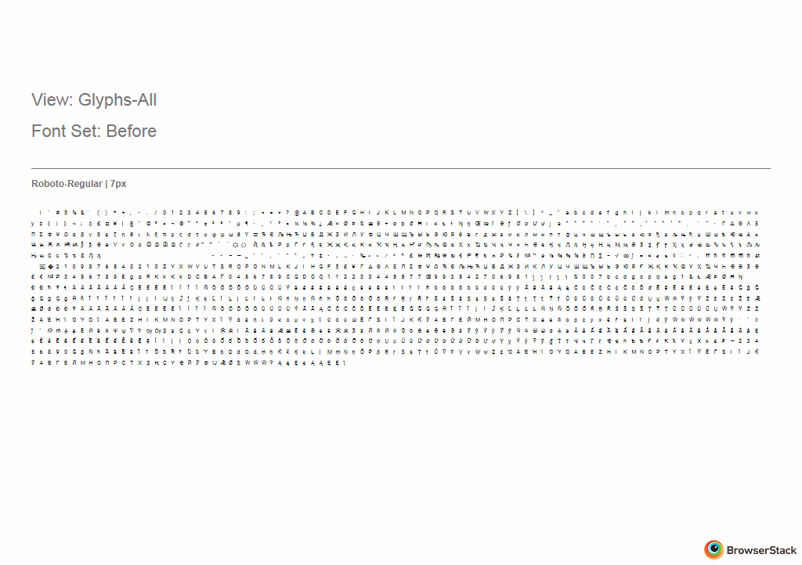

# Browserdiff

Test two sets of fonts for visual regressions on different browsers.

# 
*Output gif of Roboto compared against the version on Google Fonts. Win7 ie11*

## How it works

1. User executes cli tool
2. Fonts get posted to [GFRegression's](http://45.55.138.144/) staging area
3. GFRegression generates a url identifier for the uploaded fonts
4. Urls are generated from the user's cli params and the url identifier
5. Browserstack's screenshot api visits the urls
6. Browserstack generates and saves the screenshots to a user defined directory
7. Images for both sets are compared against each other, pixel by pixel.
8. Pixel differences are returned


## Installation

Important: This tool uses the Browserstack screenshots api. **You must have a subscription** in order to use this.

**Auth**

Create a file ~/.browserstack-api-config containing the following data:

```
[Credentials]
username = <your BrowserStack Username>
access_key = <your BrowserStack Access Key>
```

This information can be found in https://www.browserstack.com/accounts/settings


**Dependencies**

```
$ git clone https://github.com/googlefonts/diffbrowsers
$ virtualenv venv
$ source venv/bin/activate
$ pip install -r requirements.txt
$ pip install . (-e for developer mode)
```


## Usage

Important: Font names must match between the two sets.

**Produce a waterfall**

```
diffbrowsers [fonts_after] -fb [fonts_before] -o ~/Desktop/font_img
```

**Produce a glyph palette containing all glyphs at 20pt, export gifs as well**

```
diffbrowsers [fonts_after] -fb [fonts_before]  -o ~/Desktop/font_img -v glyphs-all -gif -pt 20
```

**Compare a set of fonts against the same families hosted on Google Fonts**

```
diffbrowsers [fonts_after] -gf -o ~/Desktop/font_img
```

## Caveats

Browserstack's screenshot api isn't fast. Please be patient.

If you cancel midway through a font comparison, BrowserStack may still be running. There is also no way to terminate the BrowserStack process remotely. Since most users will only have a 1 user license, users must wait for BrowserStack to finish before running again.

Sometimes BrowserStack will timeout when trying to generate a screenshot. If this happens, it will timeout gracefully, skip the screenshot and get the next browser. Unfortunately, this stability issue makes BrowserStack questionable for CI purposes. hopefully this will improve in the future.
